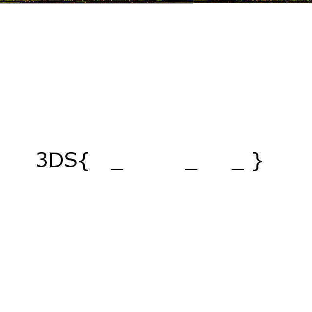

# 0liver "Imaged"
Stego 300

> 0liver is a non smart well known hacker like you are.
He has developed a "stuffs" hide technique and challenged your
hacker team to figure out what he has hidden on the attached image.

We were given a jpg image of state flags. 


I opened the image in a hex editor and learned that there was a png image hidden after the jpg file data. I extracted the png file, and saw that it had empty flag tags printed on it, but no complete flag.



At the top of the image, there was some colored pixels on black background. I wrote a script to read the pixel values. 

``` python
from PIL import Image 

def parse_file():
    with Image.open('img.png') as img:
        img_pix = img.convert('RGB')
        width, height = img.size
        plain = ''
        for i in range(height):
            for j in range(width):
                r, g, b = img_pix.getpixel((j, i))
                if b != 255:
                    plain += chr(r)
                    plain += chr(g)
                else:
                    return plain
                  
print parse_file()
```
Converting the pixel values to characters and concatenating them together revealed an ELF file. The flag could be read from the ELF files source code, or by saving it as a program and running it. The flag was 3DS{PNG_2_B!n4ry_2_4SC11}.
