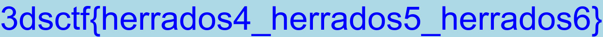

# What the hex
Forensics 
200p

> The NSA trainee was fired and left a very strange file on his desktop.<br>
> Without any success, the director asked you to take a look at this strange file. Can you figure something out?

We were given a large text file named data. Its content was hex encoded. The first bytes in the file were 464946. This is very close to jpg file signature 4a464946 so I made an assumption that the content of the data file is a hex presentation of some file, most likely a jpg file. I used xxd to convert the hex dump to a binary:
``` bash
xxd -r -p data >> output
```
Examining the binary in hex editor revealed that it didn't contain just one jpg file, but a lot of them. 3000 to be exact. Each of them was missing the start of jpg file signature. I extracted a couple of them manually to see what they looked like. They contained one line of text, that followed a pattern 3dsctf{<some_text_here>}. The flag should be 3DS{<some_text_here>}. 



It seemed likely that the flag was printed to one of the 3000 images. Next step was to read what was written in each file. It was not necessary to save the files, storing them in a variable one at a time was enough. I used the following Python script to extract each file from the original text file and to correct their signatures:

```python
def extract_files(filename):
    search_hex = '46494600'
    jfif_signature = 'FFD8FFE000004A'
    filecount = 0
    i = 0
    content = jfif_signature
    with open(filename, 'r') as f:
        while True:
            f.seek(i)
            byte = f.read(8)
            if byte == search_hex:
                read_text_from_image(content, filecount)
                content = jfif_signature
                filecount += 1
                i += 8
            else:
                f.seek(i)
                byte = f.read(2)
                if byte:
                    content += byte
                    i += 2
                else:
                    read_text_from_image(content, filecount)
                    return

```
I used [pytesseract](https://pypi.python.org/pypi/pytesseract/0.1) to read the flag from the images. It's a python wrapper for [Tesseract-OCR](https://github.com/tesseract-ocr). To be able to pass the image data to pytesseract, the data need to be converted to PIL Image object. Because in this case the image is in a string, it must first be converted to a StringIO object before opening.

``` python
def read_text_from_image(content, filecount):
    count = 0
    try:
        img = Image.open(StringIO(content.decode('hex')))
        img_text = pytesseract.image_to_string(img, \
            config='-psm 6')
        if img_text[:4] == '3DS{':
            print filecount, img_text
        count -= 1
    except KeyboardInterrupt as key:
        sys.exit()
    except IOError:
        return
```
The script found the flag from 2365th file.


Tesseract recognized the flag like this:
```
3DS{u_5hOuIdv3_7ried_tesseract}
```
'I' is a capital 'i', and the 'O' is capital 'o'. In the image it seems that the 'i' should be an 'l', and the 'o' should be 0. However, trying to return a flag with 'fixed' characters prompted about wrong flag. To get the flag right, it was necessary to type the flag exactly as Tesseract printed it, and not to try to fix characters that might seem to have been recognized wrong. 
